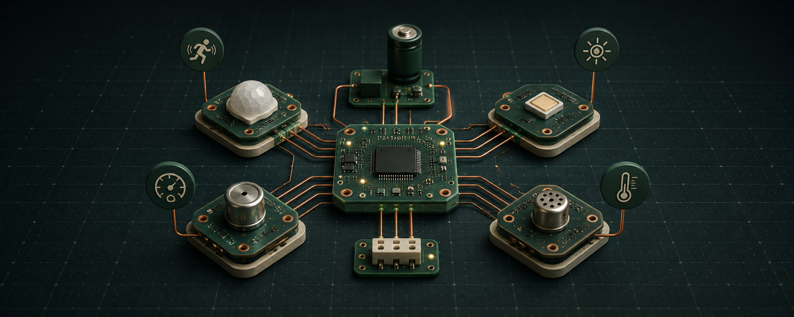

<!-- readme-refresh:start -->

  <picture>
    <source media="(prefers-color-scheme: dark)" srcset="assets/readme-banner.png">
    <source media="(prefers-color-scheme: light)" srcset="assets/readme-banner.png">
    
  </picture>

  
  

> [!IMPORTANT]
> This is a personal public fork of [Open Device Partnership embedded-sensors](https://github.com/OpenDevicePartnership/embedded-sensors). The documentation, release badges, support statements, and community links below are maintained by and refer to the upstream project unless a section explicitly says otherwise.

<strong>🔀 Fork information</strong>

| | |
|---|---|
| **Fork owner** | [al1re3a](https://github.com/al1re3a) |
| **Upstream** | [Open Device Partnership embedded-sensors](https://github.com/OpenDevicePartnership/embedded-sensors) |
| **Documentation** | Preserved from upstream below |

---
<!-- readme-refresh:end -->

# `embedded-sensors`

## Introduction

This is a Hardware Abstraction Layer (HAL) for sensors used in embedded systems.
